# java-console-banco

This project is in console mode.
This project using Maven.

## Prerequisites 🔨

1. Install Windows 10 or linux.

## Installation 🔧

1. Install windows or linux.
2. Install java 8 (1.8.0_201)
3. Install Maven

## Deploy 🚀

1. Clone project.
```
git clone https://github.com/10micky10/java-console-banco.git
```

Enter to project and execute the followings commands:

2. Compile:

```
mvn compile
```

3. Generate jar:

```
mvn package
```

4. Init program:

```
java -jar target/java-console-banco-1.0-SNAPSHOT.jar
```

5. Login:

```
Enter with: userName = micky password = holaloko
```

### checkstyle

Execute:

```
mvn checkstyle:check
```

### Command to Generate a Maven Project:

```
mvn archetype:generate -DgroupId="nombre de carpeta".com."nombre de carpeta" -DartifactId="nombre de la carpeta principal" -DarchetypeArtifactId=maven-archetype-quickstart -DarchetypeVersion=1.4 -DinteractiveMode=false
```

## Documentation

## Diagrams

### Entity Class Diagram

<p align="center">
  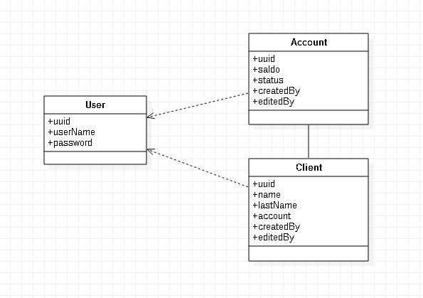
</p>

### Use Case Diagram

<p align="center">
  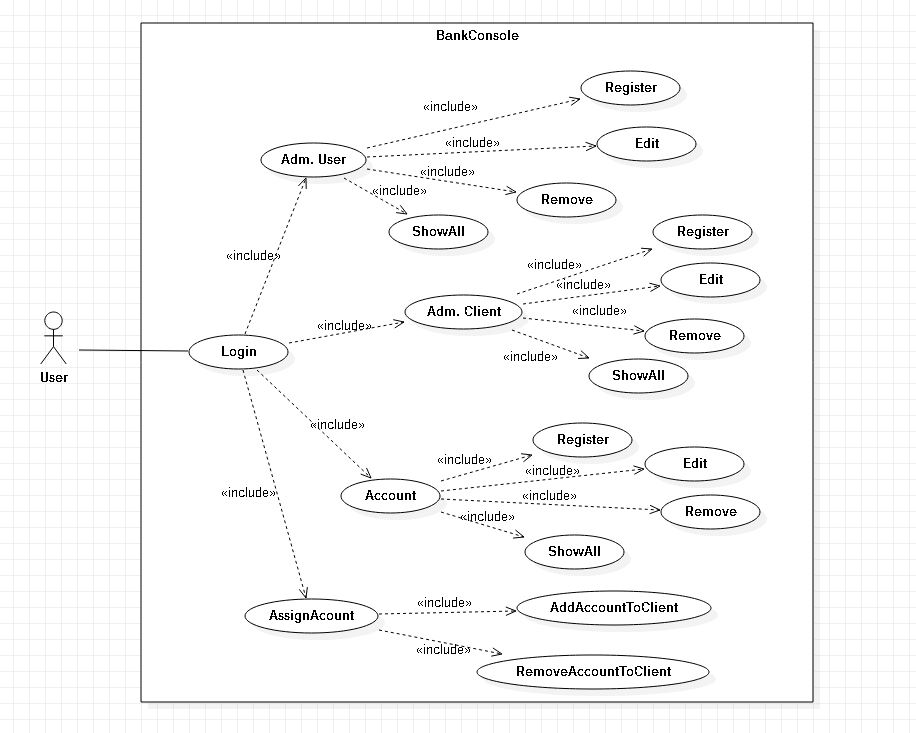
</p>

### Sequence Diagram

<p align="center">
  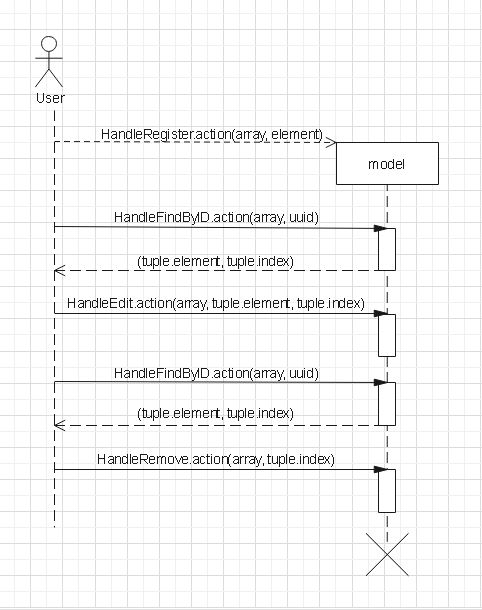
</p>

### Status Diagram

<p align="center">
  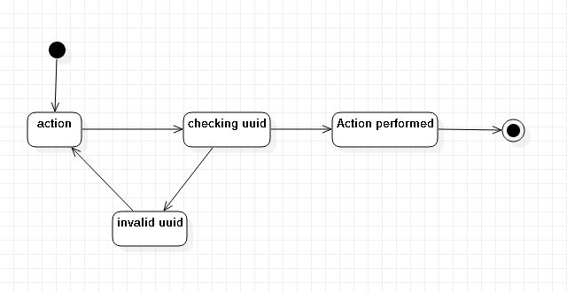
</p>

## UI

### Login

<p align="center">
  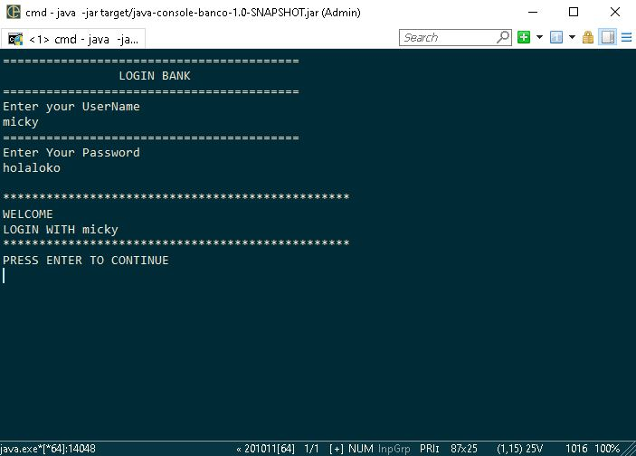
</p>

### Main menu

<p align="center">
  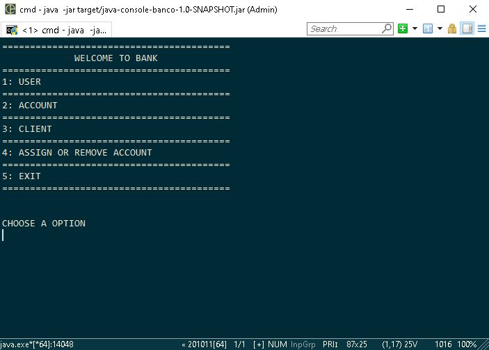
</p>

### User Menu

<p align="center">
  
</p>

### Show Users

<p align="center">
  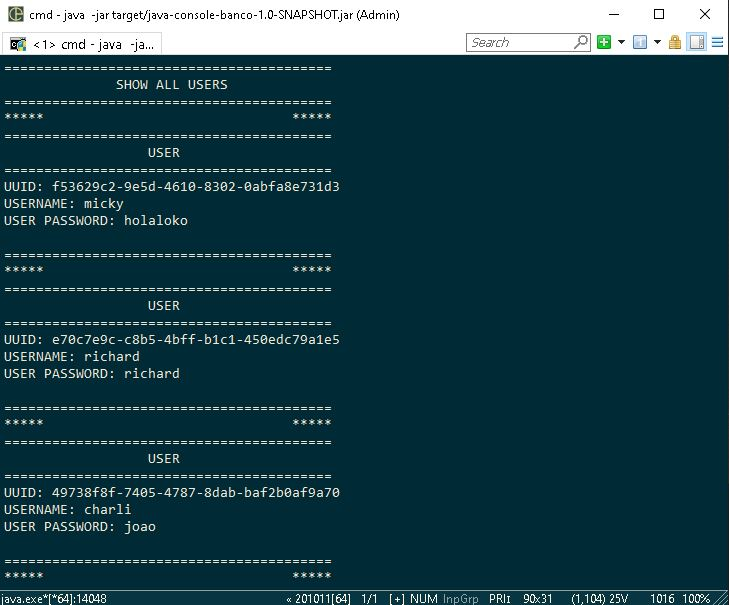
</p>

### Account Menu

<p align="center">
  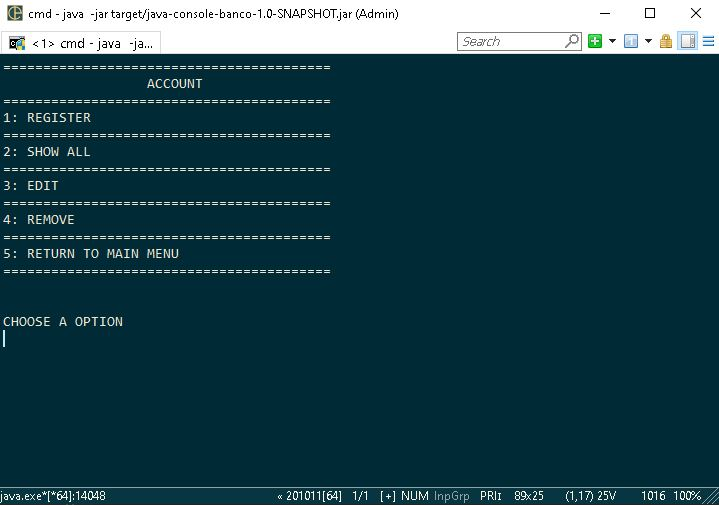
</p>

### Show Accounts

<p align="center">
  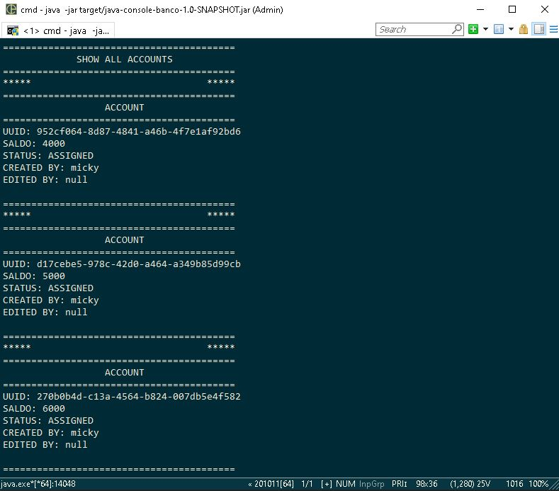
</p>

### Client Menu

<p align="center">
  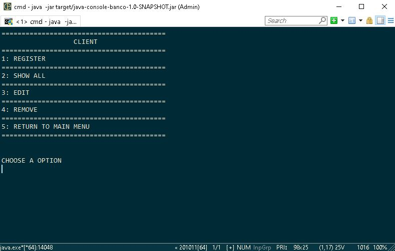
</p>

### Show Clients

<p align="center">
  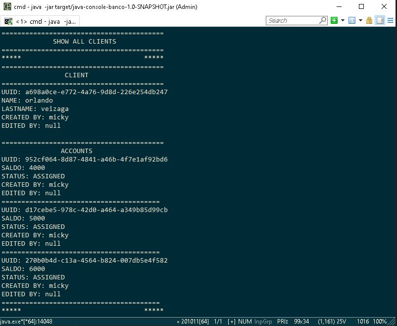
</p>

### Assign Or Remove Account Menu

<p align="center">
  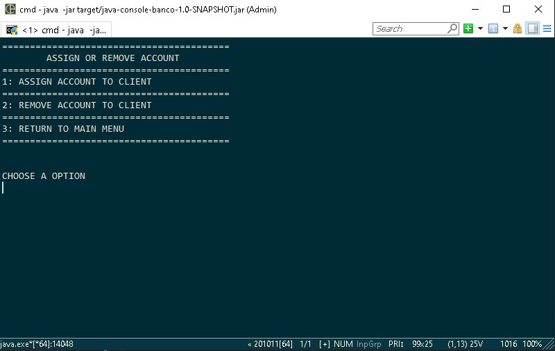
</p>

### GoodBye

<p align="center">
  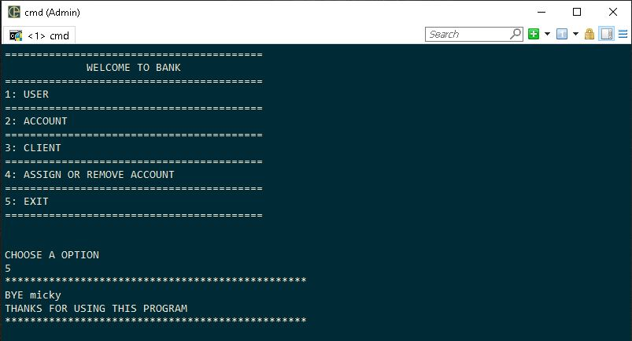
</p>
